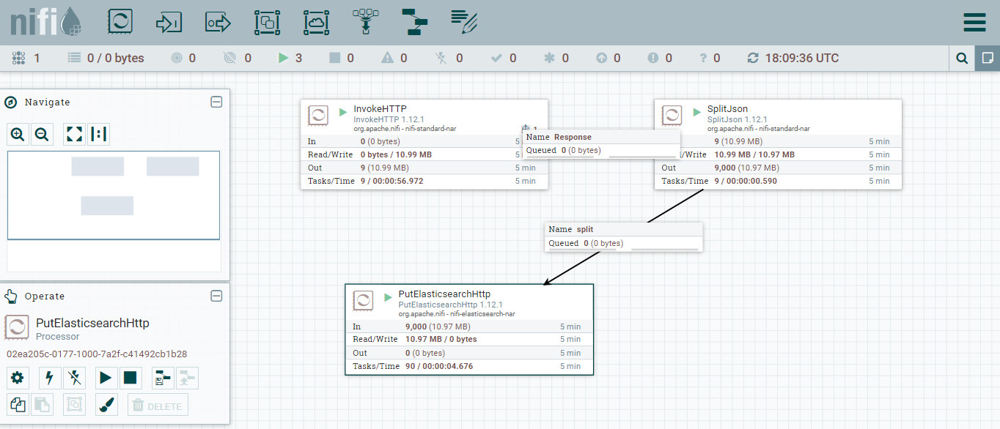
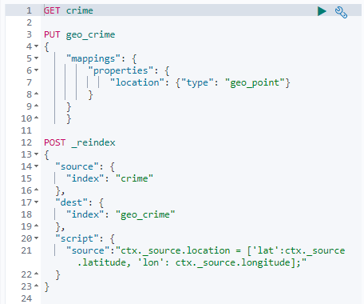
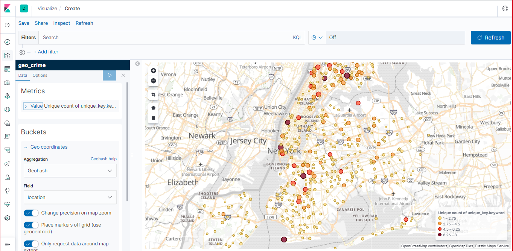
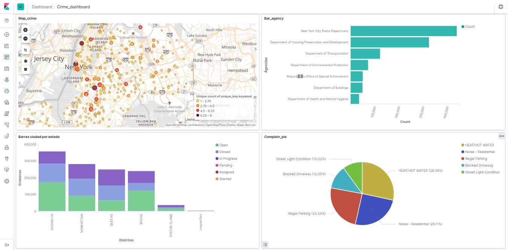

 __Alumno:__ *Jorge Camañez*
 
 __Profesor:__ *Pedro Nieto*

__EJERCICIO:__

Usando nifi+ELK, debéis presentar una solución que muestre, sobre un mapa, 
la disposición de delitos presentes en esta API:
https://data.cityofnewyork.us/Social-Services/311-Service-Requests-from-2010-to-Present/erm2-nwe9

#### 1. Creamos una archivo docker con contenedores de Nifi, ElasticSearch y Kibana en los siguientes puertos:
	
	| Component | Port |
	| --- | --- | 
	| Kibana | 5601 |
	| Elasticsearch | 9200 |
	| Nifi | 8080 |
	

#### 2. Diseñamos el flowfile en Nifi con los tres conectores siguientes, con el fin de introducir conectar la API con ELK:

  

  - InvokeHttp: Ingestar los datos vía Api.
  - SplitJSON: Dividir el JSON que ingestamos de la API en diferentes archivos.
  - PutElasticSearchHttp: Enviamos los datos a Elasticsearch con el índice "crime". 

#### 3. Desde las tools de Kibana, y creamos un nuevo índice a partir del que hemos creado con Nifi:

 

#### 4. Visualizamos el mapa de ocurrencias de crimenes

 

#### 5. Creamos un dashborad con el mapa anterior y más información del dataset.

Se pueden visualizar las incidencias por ciudad y estado, o los motivos de las incidencias por ejemplo. 

 
